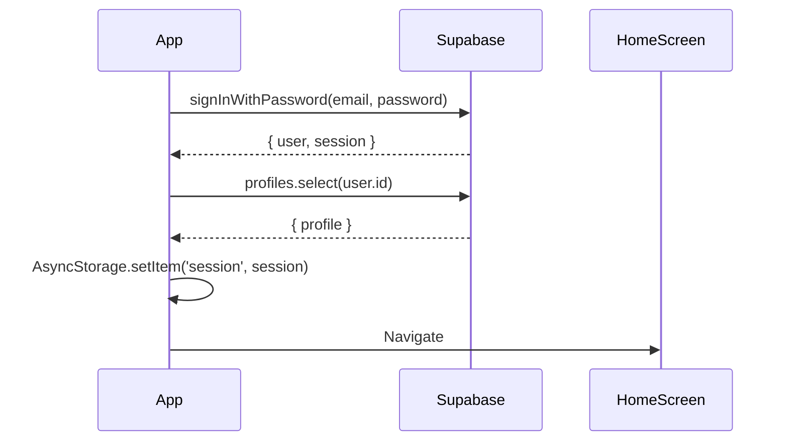
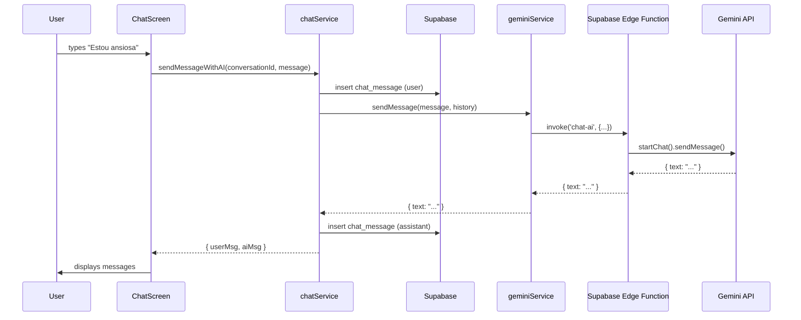

# 🏗️ Arquitetura: Nossa Maternidade

## **Visão Geral**

```
┌────────────────────────────────────────────────────────────────┐
│                     📱 CAMADA MOBILE                           │
│                  React Native + Expo 54                        │
│                                                                │
│  ┌──────────────┐  ┌──────────────┐  ┌──────────────┐        │
│  │ HomeScreen   │  │ ChatScreen   │  │ FeedScreen   │        │
│  │              │  │              │  │              │        │
│  │ • Acolhimento│  │ • NathIA IA  │  │ • MundoNath  │        │
│  │ • Respiração │  │ • Histórico  │  │ • Comunidade │        │
│  │ • Hábitos    │  │ • Streaming  │  │ • Conteúdo   │        │
│  │ • Marcos     │  │ • Áudio      │  │ • Moderação  │        │
│  └──────┬───────┘  └──────┬───────┘  └──────┬───────┘        │
│         │                 │                  │                │
│         └─────────────────┴──────────────────┘                │
│                           │                                   │
│  ┌────────────────────────▼───────────────────────────┐       │
│  │         🔧 CAMADA DE SERVIÇOS                      │       │
│  │                                                     │       │
│  │  • geminiService.ts    → Chat com IA               │       │
│  │  • chatService.ts      → Gerenciamento de chat     │       │
│  │  • profileService.ts   → Perfis de usuário         │       │
│  │  • habitsService.ts    → Sistema de hábitos        │       │
│  │  • feedService.ts      → Feed de conteúdos         │       │
│  │  • milestonesService.ts → Marcos do bebê           │       │
│  │  • sessionManager.ts   → Gerenciamento de sessão   │       │
│  └─────────────────────────┬───────────────────────────┘       │
│                            │                                   │
└────────────────────────────┼───────────────────────────────────┘
                             │
                ┌────────────┴────────────┐
                │                         │
                ▼                         ▼
┌──────────────────────────┐  ┌──────────────────────────┐
│  ☁️ SUPABASE BACKEND     │  │  🤖 GOOGLE AI            │
│  PostgreSQL + Edge Funcs │  │  Gemini 2.0 Flash        │
│                          │  │                          │
│  📊 DATABASE:            │  │  💬 CAPABILITIES:        │
│  • profiles              │  │  • Chat conversacional   │
│  • chat_conversations    │◄─┤  • Análise de emoções    │
│  • chat_messages         │  │  • Transcrição de áudio  │
│  • content_items         │  │  • Análise de diário     │
│  • user_habits           │  │  • Contextualização      │
│  • milestones            │  │                          │
│  • habit_completions     │  └──────────────────────────┘
│  • user_emotions         │
│                          │
│  🔐 AUTH:                │
│  • Email/Password        │
│  • Magic Link            │
│  • Row Level Security    │
│                          │
│  ⚡ EDGE FUNCTIONS:      │
│  • chat-ai               │
│  • analyze-emotion       │
│  • moderate-content      │
│                          │
│  📁 STORAGE:             │
│  • avatars               │
│  • audio-messages        │
│  • content-media         │
└──────────────────────────┘
```

---

## **Fluxo de Dados: Chat com IA**

### **1. Usuária Envia Mensagem**

```typescript
// ChatScreen.tsx
const handleSend = async (message: string) => {
  // 1. Usuária digita: "Estou me sentindo ansiosa"
  const { userMsg, aiMsg } = await chatService.sendMessageWithAI(conversationId, message);
};
```

### **2. ChatService Processa**

```typescript
// chatService.ts
async sendMessageWithAI(conversationId, userMessage) {
  // 1. Salva mensagem do usuário no Supabase
  const userMsg = await supabase
    .from('chat_messages')
    .insert({ conversation_id, role: 'user', content: userMessage });

  // 2. Busca histórico da conversa (últimas 20 mensagens)
  const history = await this.getMessages(conversationId);

  // 3. Chama IA para gerar resposta
  const aiResponse = await this.getAIResponse(history, userMessage);

  // 4. Salva resposta da IA no Supabase
  const aiMsg = await supabase
    .from('chat_messages')
    .insert({ conversation_id, role: 'assistant', content: aiResponse });

  return { userMsg, aiMsg };
}
```

### **3. GeminiService Chama Edge Function**

```typescript
// geminiService.ts
async sendMessage(message, history) {
  // 1. Prepara contexto da usuária
  const userContext = await this.getUserContext(); // Nome, fase da maternidade, etc.

  // 2. Monta system instruction
  const systemInstruction = `
    Você é a MãesValente, assistente maternal.
    Contexto da usuária: ${userContext}
    Regras:
    - Acolha a emoção
    - Faça perguntas abertas
    - NUNCA dê diagnósticos médicos
    - Máximo 3 parágrafos
  `;

  // 3. Chama Supabase Edge Function
  const { data, error } = await supabase.functions.invoke('chat-ai', {
    body: { message, history, systemInstruction }
  });

  return { text: data.text };
}
```

### **4. Edge Function Processa com Gemini**

```typescript
// supabase/functions/chat-ai/index.ts
serve(async (req) => {
  // 1. Valida autenticação
  const authHeader = req.headers.get('Authorization');

  // 2. Parse request
  const { message, history, systemInstruction } = await req.json();

  // 3. Inicializa Gemini
  const genAI = new GoogleGenerativeAI(Deno.env.get('GEMINI_API_KEY'));
  const model = genAI.getGenerativeModel({
    model: 'gemini-2.0-flash-exp',
    systemInstruction,
  });

  // 4. Inicia chat com histórico
  const chat = model.startChat({ history });

  // 5. Envia mensagem
  const result = await chat.sendMessage(message);
  const text = result.response.text();

  // 6. Retorna resposta
  return new Response(JSON.stringify({ text }));
});
```

### **5. Resposta Volta para o App**

```typescript
// ChatScreen.tsx
// 1. Recebe mensagens (userMsg, aiMsg)
setMessages(prev => [...prev, userMsg, aiMsg]);

// 2. Renderiza na interface
<FlashList
  data={messages}
  renderItem={({ item }) => (
    <MessageBubble
      content={item.content}
      isUser={item.role === 'user'}
    />
  )}
/>
```

---

## **Stack Tecnológica**

### **Frontend (Mobile)**

- **Framework:** React Native 0.81.5
- **Runtime:** Expo 54
- **Navegação:** React Navigation 7
- **State:** React Hooks + Context API
- **Storage:** AsyncStorage + Expo SecureStore
- **UI:** NativeWind (Tailwind para RN)
- **Icons:** Lucide React Native
- **Lists:** FlashList (performance otimizada)

### **Backend**

- **Database:** Supabase (PostgreSQL)
- **Auth:** Supabase Auth (Email + Magic Link)
- **Serverless:** Supabase Edge Functions (Deno)
- **AI:** Google Gemini 2.0 Flash
- **Storage:** Supabase Storage
- **Realtime:** Supabase Realtime (WebSockets)

### **DevOps**

- **Build:** EAS (Expo Application Services)
- **CI/CD:** GitHub Actions (opcional)
- **Monitoring:** Sentry (opcional)
- **Analytics:** Supabase Analytics
- **Logs:** Supabase Logs

---

## **Banco de Dados: Schema Supabase**

### **Tabela: profiles**

```sql
CREATE TABLE profiles (
  id UUID PRIMARY KEY REFERENCES auth.users(id),
  full_name TEXT,
  avatar_url TEXT,
  life_stage TEXT, -- 'pregnant', 'new-mother', 'experienced-mother', 'trying'
  pregnancy_weeks INTEGER,
  baby_birth_date DATE,
  created_at TIMESTAMPTZ DEFAULT NOW(),
  updated_at TIMESTAMPTZ DEFAULT NOW()
);
```

### **Tabela: chat_conversations**

```sql
CREATE TABLE chat_conversations (
  id UUID PRIMARY KEY DEFAULT uuid_generate_v4(),
  user_id UUID NOT NULL REFERENCES profiles(id),
  title TEXT,
  model TEXT DEFAULT 'gemini-2.0-flash-exp',
  created_at TIMESTAMPTZ DEFAULT NOW(),
  updated_at TIMESTAMPTZ DEFAULT NOW()
);
```

### **Tabela: chat_messages**

```sql
CREATE TABLE chat_messages (
  id UUID PRIMARY KEY DEFAULT uuid_generate_v4(),
  conversation_id UUID NOT NULL REFERENCES chat_conversations(id),
  role TEXT NOT NULL CHECK (role IN ('user', 'assistant', 'system')),
  content TEXT NOT NULL,
  metadata JSONB,
  created_at TIMESTAMPTZ DEFAULT NOW()
);
```

### **Tabela: user_habits**

```sql
CREATE TABLE user_habits (
  id UUID PRIMARY KEY DEFAULT uuid_generate_v4(),
  user_id UUID NOT NULL REFERENCES profiles(id),
  habit_id UUID REFERENCES habits(id),
  custom_name TEXT,
  current_streak INTEGER DEFAULT 0,
  best_streak INTEGER DEFAULT 0,
  total_completions INTEGER DEFAULT 0,
  is_active BOOLEAN DEFAULT true,
  created_at TIMESTAMPTZ DEFAULT NOW()
);
```

### **Tabela: habit_completions**

```sql
CREATE TABLE habit_completions (
  id UUID PRIMARY KEY DEFAULT uuid_generate_v4(),
  user_habit_id UUID NOT NULL REFERENCES user_habits(id),
  completed_at TIMESTAMPTZ DEFAULT NOW(),
  notes TEXT,
  emotion TEXT CHECK (emotion IN ('happy', 'proud', 'neutral', 'tired', 'stressed'))
);
```

### **RLS (Row Level Security)**

```sql
-- Políticas de segurança (RLS)
ALTER TABLE profiles ENABLE ROW LEVEL SECURITY;
ALTER TABLE chat_conversations ENABLE ROW LEVEL SECURITY;
ALTER TABLE chat_messages ENABLE ROW LEVEL SECURITY;

-- Usuários só podem ver seus próprios dados
CREATE POLICY "Users can view own profile"
  ON profiles FOR SELECT
  USING (auth.uid() = id);

CREATE POLICY "Users can view own conversations"
  ON chat_conversations FOR SELECT
  USING (auth.uid() = user_id);

CREATE POLICY "Users can view own messages"
  ON chat_messages FOR SELECT
  USING (
    conversation_id IN (
      SELECT id FROM chat_conversations WHERE user_id = auth.uid()
    )
  );
```

---

## **Segurança**

### **1. API Keys (Nunca Expor no Cliente)**

```typescript
// ❌ ERRADO - Expõe API key no cliente
const genAI = new GoogleGenerativeAI('AIzaSy...');

// ✅ CERTO - API key fica no servidor (Edge Function)
const { data } = await supabase.functions.invoke('chat-ai', {
  body: { message },
});
```

### **2. Autenticação JWT**

```typescript
// Supabase gerencia JWT automaticamente
const {
  data: { session },
} = await supabase.auth.getSession();
// Token JWT é enviado em todas as requisições automaticamente
```

### **3. Row Level Security (RLS)**

- Usuários só veem seus próprios dados
- Políticas aplicadas no banco (não confiamos no cliente)
- Queries automáticas respeitam RLS

### **4. Rate Limiting**

```typescript
// Edge Function pode implementar rate limiting
const rateLimiter = new Map();
const userIp = req.headers.get('x-forwarded-for');
const requests = rateLimiter.get(userIp) || 0;

if (requests > 10) {
  return new Response('Too many requests', { status: 429 });
}
```

---

## **Performance**

### **1. Otimizações no App**

- **FlashList** em vez de FlatList (50% mais rápido)
- **Memo** para componentes pesados
- **Lazy loading** de telas
- **Image caching** com Expo Image
- **Debounce** em inputs de busca

### **2. Otimizações no Backend**

- **Gemini 2.0 Flash** (latência < 2s)
- **Histórico limitado** (últimas 20 mensagens)
- **Índices no banco** (conversation_id, user_id, created_at)
- **Edge Functions** perto do usuário (CDN global)

### **3. Caching**

```typescript
// Cache de contexto do usuário (5 minutos)
const userContext = await AsyncStorage.getItem('user_context');
if (userContext && Date.now() - userContext.timestamp < 300000) {
  return userContext.data;
}
```

---

## **Monitoramento**

### **1. Logs Estruturados**

```typescript
console.log('[ChatService] sendMessage', {
  conversationId,
  messageLength: message.length,
  timestamp: Date.now(),
});
```

### **2. Métricas**

- Tempo de resposta da IA
- Taxa de erro
- Uso de tokens
- Sessões ativas
- Mensagens por usuário

### **3. Alertas**

- Erro 500 > 5% → Alert
- Latência > 5s → Alert
- Taxa de rejeição > 10% → Alert

---

## **Custos Mensais (Estimativa para 1000 usuárias ativas)**

| Serviço                     | Uso             | Custo          |
| --------------------------- | --------------- | -------------- |
| **Supabase Database**       | 500 MB          | $0 (free tier) |
| **Supabase Edge Functions** | 300k invocações | $0 (free tier) |
| **Supabase Auth**           | 1000 usuárias   | $0 (free tier) |
| **Supabase Storage**        | 5 GB            | $0 (free tier) |
| **Gemini 2.0 Flash**        | 300k mensagens  | ~$5/mês        |
| **EAS Build**               | 2 builds/mês    | $0 (hobby)     |
| **TOTAL**                   |                 | **~$5/mês**    |

**Escalando para 10k usuárias:**

- Supabase: $25/mês (Pro plan)
- Gemini: $50/mês
- **TOTAL: ~$75/mês**

---

## **Roadmap Técnico**

### **Fase 1: MVP (Completo ✅)**

- ✅ Auth + Login
- ✅ Chat com IA (Gemini)
- ✅ Feed de conteúdos
- ✅ Perfil de usuário
- ✅ Sistema de hábitos
- ✅ Navegação completa

### **Fase 2: Comunidade (Próxima)**

- [ ] Posts de comunidade (MãesValente)
- [ ] Comentários e reações
- [ ] Moderação automática (IA)
- [ ] Notificações push

### **Fase 3: Gamificação**

- [ ] Pontos e badges
- [ ] Streaks avançadas
- [ ] Desafios semanais
- [ ] Ranking (opcional)

### **Fase 4: Premium**

- [ ] Conteúdo exclusivo
- [ ] Chat sem limites
- [ ] Análises personalizadas
- [ ] Suporte prioritário

---

## **Diagramas de Sequência**

### **Login Flow:**



### **Chat Flow:**



---

**Arquitetura aprovada por:** Lion (Gabriel)
**Última atualização:** Janeiro 2025
**Versão:** 1.0.0
