# Data Model MVP - Nossa Maternidade

> Documentação do modelo de dados das 16 tabelas do MVP

---

## Resumo

| Domínio | Tabelas | Descrição |
|---------|---------|-----------|
| Core | 6 | profiles, community_posts, chat_sessions, chat_messages, habits, habit_logs |
| Comunidade | 4 | community_comments, community_likes, post_reactions, content_favorites |
| LGPD | 4 | consent_terms_versions, user_consents, user_feature_flags, postpartum_screenings |
| Crise/Moderação | 2 | crisis_interventions, moderation_queue |

**Total: 16 tabelas**

---

## Diagrama ER (Mermaid)

```mermaid
erDiagram
    %% ===== CORE =====
    auth_users ||--|| profiles : "1:1"
    profiles {
        uuid id PK "= auth.users.id"
        text email
        text name
        text full_name
        text phase "gestacao, pos_parto..."
        int pregnancy_week
        date due_date
        text baby_name
        date baby_birth_date
        bool onboarding_completed
        text current_emotion
        timestamptz created_at
        timestamptz updated_at
    }

    profiles ||--o{ community_posts : "author"
    community_posts {
        uuid id PK
        uuid author_id FK
        text title
        text content
        text category
        text status "pending, approved, rejected"
        int like_count
        int comment_count
        timestamptz published_at
        timestamptz created_at
    }

    profiles ||--o{ chat_sessions : "user"
    chat_sessions {
        uuid id PK
        uuid user_id FK
        text title
        text model
        text summary
        int message_count
        timestamptz started_at
        timestamptz updated_at
    }

    chat_sessions ||--o{ chat_messages : "conversation"
    chat_messages {
        uuid id PK
        uuid conversation_id FK
        uuid user_id FK
        text role "user, assistant, system"
        text content
        jsonb metadata
        timestamptz created_at
    }

    profiles ||--o{ habits : "user"
    habits {
        uuid id PK
        uuid user_id FK
        text name
        text description
        text frequency
        int current_streak
        bool active
        timestamptz created_at
    }

    habits ||--o{ habit_logs : "habit"
    habit_logs {
        uuid id PK
        uuid habit_id FK
        uuid user_id FK
        timestamptz completed_at
        text notes
        text mood
    }

    %% ===== COMUNIDADE =====
    community_posts ||--o{ community_comments : "post"
    community_comments {
        uuid id PK
        uuid post_id FK
        uuid author_id FK
        uuid parent_id FK "self-ref para replies"
        text content
        text status
        int like_count
        timestamptz created_at
    }

    profiles ||--o{ community_likes : "user"
    community_likes {
        uuid id PK
        uuid user_id FK
        uuid post_id FK "nullable"
        uuid comment_id FK "nullable"
        timestamptz created_at
    }

    profiles ||--o{ post_reactions : "user"
    post_reactions {
        uuid id PK
        uuid user_id FK
        uuid post_id FK
        text reaction_type "like, love, support, hug"
        timestamptz created_at
    }

    profiles ||--o{ content_favorites : "user"
    content_favorites {
        uuid id PK
        uuid user_id FK
        text content_type "post, article, video"
        uuid content_id
        text folder
        timestamptz created_at
    }

    %% ===== LGPD =====
    consent_terms_versions ||--o{ user_consents : "terms"
    consent_terms_versions {
        uuid id PK
        text version
        consent_type consent_type
        text title
        text summary
        text full_text
        bool is_current
        timestamptz effective_from
    }

    profiles ||--o{ user_consents : "user"
    user_consents {
        uuid id PK
        uuid user_id FK
        uuid terms_version_id FK
        consent_type consent_type
        consent_status status
        timestamptz granted_at
        timestamptz revoked_at
        inet ip_address
        text collection_method
    }

    profiles ||--o{ user_feature_flags : "user"
    user_feature_flags {
        uuid id PK
        uuid user_id FK
        text flag_name
        jsonb flag_value
        text source
        bool enabled
        timestamptz expires_at
    }

    profiles ||--o{ postpartum_screenings : "user"
    postpartum_screenings {
        uuid id PK
        uuid user_id FK
        screening_type screening_type "epds, phq9, gad7"
        jsonb responses
        int total_score
        screening_result result
        bool requires_followup
        timestamptz completed_at
    }

    %% ===== CRISE/MODERAÇÃO =====
    profiles ||--o{ crisis_interventions : "user"
    crisis_interventions {
        uuid id PK
        uuid user_id FK
        crisis_level level "low, moderate, severe, critical"
        crisis_type[] types
        intervention_status status
        text trigger_message
        bool follow_up_needed
        int priority
        timestamptz detected_at
        timestamptz resolved_at
    }

    profiles ||--o{ moderation_queue : "author"
    moderation_queue {
        uuid id PK
        uuid content_id
        content_type content_type
        text content_text
        uuid author_id FK
        moderation_source source
        moderation_status status
        int priority
        decimal ai_safety_score
        uuid assigned_to
        timestamptz created_at
    }
```



---

## Detalhamento por Tabela

### 1. profiles

**Descrição:** Perfis das usuárias, extensão 1:1 do `auth.users` do Supabase.

**Colunas principais:**
| Coluna | Tipo | Descrição |
|--------|------|-----------|
| id | UUID | PK, igual ao auth.users.id |
| email | TEXT | Email da usuária |
| name / full_name | TEXT | Nome para exibição |
| phase | TEXT | Fase: gestacao, pos_parto, etc |
| pregnancy_week | INT | Semana gestacional (1-42) |
| baby_birth_date | DATE | Data nascimento do bebê |
| onboarding_completed | BOOL | Se completou onboarding |
| current_emotion | TEXT | Última emoção registrada |

**Features/Telas:**
- OnboardingScreen
- HomeScreen (saudação)
- ProfileScreen
- SettingsScreen

---

### 2. community_posts

**Descrição:** Posts da comunidade criados pelas usuárias.

**Colunas principais:**
| Coluna | Tipo | Descrição |
|--------|------|-----------|
| author_id | UUID | FK → profiles |
| title | TEXT | Título do post |
| content | TEXT | Conteúdo |
| status | TEXT | pending/approved/rejected |
| like_count | INT | Contador desnormalizado |
| published_at | TIMESTAMPTZ | Quando foi publicado |

**Features/Telas:**
- CommunityScreen (feed)
- PostDetailScreen
- CreatePostScreen

---

### 3. chat_sessions

**Descrição:** Sessões de conversa com a NathIA (assistente IA).

**Colunas principais:**
| Coluna | Tipo | Descrição |
|--------|------|-----------|
| user_id | UUID | FK → profiles |
| title | TEXT | Título da conversa |
| model | TEXT | Modelo IA usado |
| message_count | INT | Total de mensagens |
| summary | TEXT | Resumo gerado por IA |

**Features/Telas:**
- ChatScreen
- ChatHistoryScreen

**NOTA:** Renomeada de `chat_conversations` para `chat_sessions`. O código usa `conversation_id` nas mensagens para manter compatibilidade.

---

### 4. chat_messages

**Descrição:** Mensagens individuais dentro de uma sessão de chat.

**Colunas principais:**
| Coluna | Tipo | Descrição |
|--------|------|-----------|
| conversation_id | UUID | FK → chat_sessions |
| user_id | UUID | FK → profiles |
| role | TEXT | user/assistant/system |
| content | TEXT | Conteúdo da mensagem |
| metadata | JSONB | Tool calls, tokens, etc |

**Features/Telas:**
- ChatScreen

---

### 5. habits

**Descrição:** Hábitos definidos pelas usuárias para acompanhamento.

**Colunas principais:**
| Coluna | Tipo | Descrição |
|--------|------|-----------|
| user_id | UUID | FK → profiles |
| name | TEXT | Nome do hábito |
| frequency | TEXT | daily/weekly/custom |
| current_streak | INT | Sequência atual |
| active | BOOL | Se está ativo |

**Features/Telas:**
- HabitsScreen
- HomeScreen (widget)

---

### 6. habit_logs

**Descrição:** Registros de quando um hábito foi completado.

**Colunas principais:**
| Coluna | Tipo | Descrição |
|--------|------|-----------|
| habit_id | UUID | FK → habits |
| user_id | UUID | FK → profiles |
| completed_at | TIMESTAMPTZ | Quando completou |
| mood | TEXT | great/good/neutral/bad |

**Features/Telas:**
- HabitsScreen
- StatsScreen

---

### 7. community_comments

**Descrição:** Comentários em posts da comunidade (suporta threading).

**Colunas principais:**
| Coluna | Tipo | Descrição |
|--------|------|-----------|
| post_id | UUID | FK → community_posts |
| author_id | UUID | FK → profiles |
| parent_id | UUID | FK → self (para replies) |
| content | TEXT | Conteúdo |
| status | TEXT | pending/approved/rejected |

**Features/Telas:**
- PostDetailScreen
- CommentSection

---

### 8. community_likes

**Descrição:** Likes em posts e comentários.

**Colunas principais:**
| Coluna | Tipo | Descrição |
|--------|------|-----------|
| user_id | UUID | FK → profiles |
| post_id | UUID | FK → community_posts (nullable) |
| comment_id | UUID | FK → community_comments (nullable) |

**Constraint:** `post_id XOR comment_id` (exatamente um deve ser preenchido)

---

### 9. post_reactions

**Descrição:** Reações expressivas (além do like simples).

**Colunas principais:**
| Coluna | Tipo | Descrição |
|--------|------|-----------|
| user_id | UUID | FK → profiles |
| post_id | UUID | FK → community_posts |
| reaction_type | TEXT | like/love/support/hug |

---

### 10. content_favorites

**Descrição:** Conteúdos salvos/favoritados pelas usuárias.

**Colunas principais:**
| Coluna | Tipo | Descrição |
|--------|------|-----------|
| user_id | UUID | FK → profiles |
| content_type | TEXT | post/article/video |
| content_id | UUID | ID do conteúdo |
| folder | TEXT | Organização por pasta |

**Features/Telas:**
- FavoritesScreen
- PostDetailScreen (botão salvar)

---

### 11. consent_terms_versions

**Descrição:** Versões dos termos de consentimento (LGPD).

**Colunas principais:**
| Coluna | Tipo | Descrição |
|--------|------|-----------|
| version | VARCHAR(20) | Ex: "1.0.0" |
| consent_type | ENUM | essential/ai_processing/analytics/marketing/health_data |
| is_current | BOOL | Versão atual ativa |
| full_text | TEXT | Texto legal completo |
| content_hash | VARCHAR(64) | SHA-256 para integridade |

---

### 12. user_consents

**Descrição:** Registro de consentimentos das usuárias (append-only).

**Colunas principais:**
| Coluna | Tipo | Descrição |
|--------|------|-----------|
| user_id | UUID | FK → profiles |
| terms_version_id | UUID | FK → consent_terms_versions |
| status | ENUM | granted/revoked/expired |
| granted_at | TIMESTAMPTZ | Quando aceitou |
| ip_address | INET | IP para auditoria |
| collection_method | VARCHAR | onboarding/settings/prompt |

**IMPORTANTE:** Tabela append-only para LGPD. Revogação = novo registro.

---

### 13. user_feature_flags

**Descrição:** Feature flags por usuário para rollout gradual.

**Colunas principais:**
| Coluna | Tipo | Descrição |
|--------|------|-----------|
| user_id | UUID | FK → profiles |
| flag_name | TEXT | Nome da flag |
| flag_value | JSONB | Valor (pode ser bool/string/objeto) |
| enabled | BOOL | Se está ativa |
| expires_at | TIMESTAMPTZ | Expiração opcional |

**Flags especiais:**
- `moderator` → Habilita acesso à moderação

---

### 14. postpartum_screenings

**Descrição:** Resultados de screenings de saúde mental.

**Colunas principais:**
| Coluna | Tipo | Descrição |
|--------|------|-----------|
| user_id | UUID | FK → profiles |
| screening_type | ENUM | epds/phq9/gad7/custom |
| responses | JSONB | Respostas individuais |
| total_score | INT | Pontuação calculada |
| result | ENUM | low_risk/moderate_risk/high_risk |
| requires_followup | BOOL | Se precisa acompanhamento |

**Features/Telas:**
- ScreeningScreen
- HealthScreen

---

### 15. crisis_interventions

**Descrição:** Registro de intervenções em situações de crise detectadas pela IA.

**Colunas principais:**
| Coluna | Tipo | Descrição |
|--------|------|-----------|
| user_id | UUID | FK → profiles |
| level | ENUM | low/moderate/severe/critical |
| types | ARRAY | suicidal_ideation, postpartum_depression, etc |
| status | ENUM | detected/resources_shown/resolved/... |
| trigger_message | TEXT | Mensagem que disparou alerta |
| priority | INT | 1-10 (10=emergência) |
| follow_up_needed | BOOL | Se precisa follow-up |

**Features/Telas:**
- ChatScreen (detecção)
- CrisisDashboardScreen (moderadores)

**DADOS SENSÍVEIS:** RLS restrito. Usuária vê próprios; moderadores veem todos.

---

### 16. moderation_queue

**Descrição:** Fila de conteúdos para moderação.

**Colunas principais:**
| Coluna | Tipo | Descrição |
|--------|------|-----------|
| content_id | UUID | ID do post/comentário |
| content_type | ENUM | post/comment/reply/... |
| author_id | UUID | FK → profiles |
| source | ENUM | auto_filter/ai_review/user_report |
| status | ENUM | pending/approved/rejected/... |
| priority | INT | 1-10 |
| ai_safety_score | DECIMAL | Score de segurança da IA |
| assigned_to | UUID | Moderador atribuído |

**Features/Telas:**
- ModerationDashboardScreen (moderadores)

---

## ENUMs Utilizados

```sql
-- Crise
crisis_level: low, moderate, severe, critical
crisis_type: suicidal_ideation, self_harm, postpartum_depression, anxiety_attack, overwhelm, domestic_violence, baby_safety, other
intervention_status: detected, resources_shown, user_acknowledged, contacted_cvv, contacted_samu, contacted_caps, continued_chat, left_app, resolved, escalated, follow_up_pending, follow_up_completed

-- Moderação
moderation_status: pending, assigned, in_review, approved, rejected, escalated, appealed, appeal_approved, appeal_rejected
content_type: post, comment, reply, profile_bio, profile_photo, message
moderation_source: auto_filter, ai_review, user_report, manual, appeal
rejection_reason: spam, hate_speech, harassment, nsfw, violence, self_harm, medical_misinformation, personal_info, advertising, off_topic, duplicate, other

-- LGPD
consent_type: essential, ai_processing, analytics, marketing, data_sharing, health_data
consent_status: granted, revoked, expired, pending

-- Screening
screening_type: epds, phq9, gad7, custom
screening_result: low_risk, moderate_risk, high_risk, inconclusive
```

---

## RLS (Row Level Security)

### Grupos de Acesso

**A) User-owned (dados pessoais):**
- Usuária só acessa próprios dados
- `WHERE auth.uid() = user_id`
- Tabelas: profiles, chat_sessions, chat_messages, habits, habit_logs, content_favorites, user_consents, user_feature_flags, postpartum_screenings

**B) Conteúdo público moderado:**
- Leitura: posts/comentários aprovados
- Escrita: próprio conteúdo
- Moderadores: acesso total
- Tabelas: community_posts, community_comments, community_likes, post_reactions

**C) Sensíveis/Administrativos:**
- Apenas service_role ou moderadores
- Tabelas: moderation_queue, crisis_interventions (leitura por moderadores)

---

## Migrations

Ordem de execução:

1. `00_types.sql` - ENUMs e função update_updated_at
2. `01_core_tables.sql` - profiles, community_posts, chat_sessions, chat_messages, habits, habit_logs
3. `02_community_reactions.sql` - community_comments, community_likes, post_reactions, content_favorites
4. `03_lgpd_flags_screenings.sql` - consent_terms_versions, user_consents, user_feature_flags, postpartum_screenings
5. `04_crisis_moderation.sql` - crisis_interventions, moderation_queue
6. `05_rls_policies.sql` - Todas as RLS policies
7. `seed.sql` - Dados de desenvolvimento

**Comando:**
```bash
supabase db reset
# ou
supabase migration up
```

---

## Diagrama para dbdiagram.io

```dbml
// Copie e cole em dbdiagram.io

Table profiles {
  id uuid [pk]
  email text
  name text
  phase text
  pregnancy_week int
  baby_birth_date date
  onboarding_completed bool
  created_at timestamptz
}

Table community_posts {
  id uuid [pk]
  author_id uuid [ref: > profiles.id]
  title text
  content text
  status text
  like_count int
  published_at timestamptz
}

Table chat_sessions {
  id uuid [pk]
  user_id uuid [ref: > profiles.id]
  title text
  message_count int
}

Table chat_messages {
  id uuid [pk]
  conversation_id uuid [ref: > chat_sessions.id]
  user_id uuid [ref: > profiles.id]
  role text
  content text
}

Table habits {
  id uuid [pk]
  user_id uuid [ref: > profiles.id]
  name text
  frequency text
  current_streak int
}

Table habit_logs {
  id uuid [pk]
  habit_id uuid [ref: > habits.id]
  user_id uuid [ref: > profiles.id]
  completed_at timestamptz
}

Table community_comments {
  id uuid [pk]
  post_id uuid [ref: > community_posts.id]
  author_id uuid [ref: > profiles.id]
  parent_id uuid [ref: > community_comments.id]
  content text
  status text
}

Table community_likes {
  id uuid [pk]
  user_id uuid [ref: > profiles.id]
  post_id uuid [ref: > community_posts.id]
  comment_id uuid [ref: > community_comments.id]
}

Table consent_terms_versions {
  id uuid [pk]
  version text
  consent_type text
  is_current bool
}

Table user_consents {
  id uuid [pk]
  user_id uuid [ref: > profiles.id]
  terms_version_id uuid [ref: > consent_terms_versions.id]
  status text
  granted_at timestamptz
}

Table user_feature_flags {
  id uuid [pk]
  user_id uuid [ref: > profiles.id]
  flag_name text
  enabled bool
}

Table postpartum_screenings {
  id uuid [pk]
  user_id uuid [ref: > profiles.id]
  screening_type text
  total_score int
  result text
}

Table crisis_interventions {
  id uuid [pk]
  user_id uuid [ref: > profiles.id]
  level text
  status text
  priority int
}

Table moderation_queue {
  id uuid [pk]
  content_id uuid
  author_id uuid [ref: > profiles.id]
  status text
  priority int
}
```

---

*Última atualização: Dezembro 2025*
