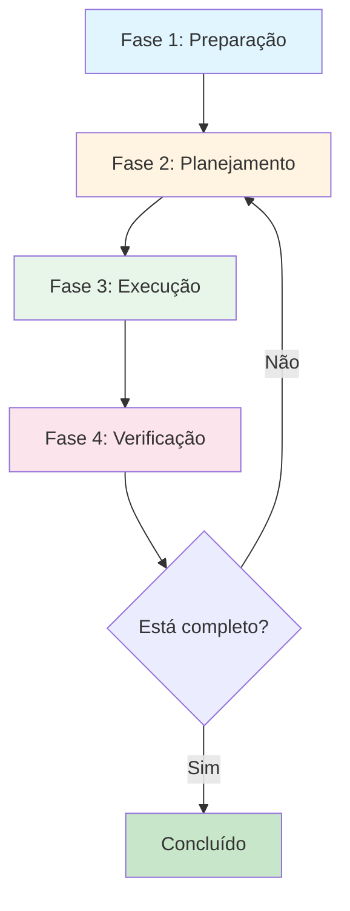

# Fluxo de Trabalho Estruturado: Do Caos à Clareza

> **Ciclo virtuoso para organizar qualquer tarefa complexa**
>
> **Baseado em:** "Silêncio Estruturado: IA e Organização"

---

## Visão Geral

Este fluxo transforma tarefas complexas e sobrecargas em processos claros e gerenciáveis. É um ciclo de 4 fases que você pode repetir quantas vezes necessário.

---

## Diagrama do Fluxo

---

## Fase 1: Preparação (Setup)

**Objetivo:** Garantir que você tem todo o contexto e informações necessárias.

**Tempo estimado:** 5-15 minutos

**Nível de energia:** Baixo

### Checklist

- [ ] **Criar ou atualizar `CONTEXTO.md`**
  - Se já existe, revisar e atualizar se necessário
  - Se não existe, criar com informações essenciais do projeto

- [ ] **Reunir informações necessárias**
  - Documentos relevantes
  - Código relacionado
  - Requisitos ou especificações
  - Dependências conhecidas

- [ ] **Preparar ambiente de trabalho**
  - Abrir arquivos relevantes no editor
  - Verificar que ferramentas estão funcionando
  - Limpar distrações

### Quando está pronto?

Você sabe:

- O que precisa fazer (objetivo claro)
- Por que está fazendo (contexto)
- O que precisa para começar (recursos)

---

## Fase 2: Planejamento (Plan)

**Objetivo:** Quebrar a tarefa em fases gerenciáveis e criar um plano de ação.

**Tempo estimado:** 10-30 minutos

**Nível de energia:** Médio

### Checklist

- [ ] **Pedir à IA para criar um plano de fases**
  - Use o prompt: "Crie um plano em [X] fases para [objetivo]"
  - Ou use o template: `docs/ORGANIZACAO/template-plano.md`

- [ ] **Salvar o plano em um arquivo**
  - Nome: `plano-[nome-da-tarefa].md`
  - Localização: `docs/ORGANIZACAO/planos/` (ou onde fizer sentido)

- [ ] **Revisar o plano**
  - Cada fase tem objetivo claro?
  - Tempo estimado é realista?
  - Dependências estão claras?
  - Ajustar se necessário

- [ ] **(Opcional) Gerar diagrama visual**
  - Pedir à IA: "Descreva este plano no formato Mermaid.js"
  - Visualizar em [Mermaid.live](https://mermaid.live)

### Quando está pronto?

Você tem:

- Plano claro com fases numeradas
- Cada fase com objetivo, tempo e dependências
- Plano salvo e acessível

---

## Fase 3: Execução (Execute)

**Objetivo:** Trabalhar em uma fase por vez, focando apenas no que está na frente.

**Tempo estimado:** Variável (conforme plano)

**Nível de energia:** Médio/Alto

### Checklist

- [ ] **Iniciar novo chat na IA (se necessário)**
  - Entre fases complexas, iniciar novo chat
  - Fornecer `CONTEXTO.md` e o plano
  - Dizer: "Vamos focar apenas na Fase X do plano"

- [ ] **Focar em uma fase por vez**
  - Não pular para próxima fase
  - Completar checklist da fase atual
  - Validar critérios de sucesso

- [ ] **Usar prompts específicos**
  - Não: "Me ajude com isso"
  - Sim: "Refatore HomeScreen.tsx para usar design tokens. Mantenha mesma funcionalidade, apenas style updates."

- [ ] **Marcar progresso**
  - Atualizar checklist do plano
  - Commit intermediário se fizer sentido

### Quando está pronto?

A fase atual está:

- Checklist completo
- Critérios de sucesso atendidos
- Pronta para próxima fase

---

## Fase 4: Verificação (Verify & Refine)

**Objetivo:** Validar que tudo funciona e refinar se necessário.

**Tempo estimado:** 10-30 minutos

**Nível de energia:** Baixo/Médio

### Checklist

- [ ] **Revisar resultado da fase**
  - Funciona como esperado?
  - Atende aos critérios de sucesso?
  - Há algo que pode melhorar?

- [ ] **Validar qualidade**
  - `npm run type-check` → 0 errors
  - `npm run lint` → 0 critical warnings
  - `npm run validate:design` → 0 violations (se aplicável)
  - `npm test` → All green

- [ ] **Se algo der errado: investigar o "porquê"**
  - Pergunta 1: O contexto era suficiente? (IA tinha `CONTEXTO.md`?)
  - Pergunta 2: O pedido foi específico? (evitar "gradiente roxo")
  - Pergunta 3: A memória de curto prazo esgotou? (conversa muito longa?)
  - Solução: Iniciar novo chat, fornecer contexto e plano, continuar

- [ ] **Refinar se necessário**
  - Ajustar código
  - Atualizar plano se necessário
  - Documentar aprendizados

- [ ] **Decidir próximo passo**
  - Se completo: Marcar como concluído
  - Se não completo: Voltar para Fase 2 (ajustar plano) ou Fase 3 (próxima fase)

### Quando está pronto?

Você tem:

- Resultado validado e funcionando
- Qualidade verificada
- Próximo passo claro (concluir ou continuar)

---

## Quando Iniciar Novo Chat?

**Regra de ouro:** Entre fases complexas, inicie um novo chat.

**Por quê?**

- Renova o foco da IA
- Evita esgotamento de contexto
- Garante que IA tem contexto completo

**Como fazer:**

1. Salve o progresso atual (commit, notas, etc.)
2. Inicie novo chat
3. Forneça `CONTEXTO.md` e o plano
4. Diga: "Vamos focar apenas na Fase X do plano [link]"

---

## Exemplo Prático

### Cenário: Refatorar HomeScreen para usar design tokens

**Fase 1: Preparação**

- ✅ Revisar `CONTEXTO.md` (já existe)
- ✅ Abrir `src/screens/HomeScreen.tsx`
- ✅ Verificar `src/theme/tokens.ts`

**Fase 2: Planejamento**

- ✅ Pedir à IA: "Crie um plano em 3 fases para refatorar HomeScreen.tsx usando design tokens"
- ✅ Salvar plano em `docs/ORGANIZACAO/planos/refatorar-homescreen.md`
- ✅ Revisar plano

**Fase 3: Execução**

- ✅ Fase 1: Substituir cores hardcoded por `useThemeColors()`
- ✅ Fase 2: Substituir espaçamentos hardcoded por `Tokens.spacing`
- ✅ Fase 3: Adicionar accessibility labels

**Fase 4: Verificação**

- ✅ `npm run type-check` → 0 errors
- ✅ `npm run validate:design` → 0 violations
- ✅ Testar em device
- ✅ Commit: "refactor: HomeScreen usa design tokens"

---

## Dicas para Sucesso

### Para Desenvolvedores Neurodivergentes

1. **Quebre em partes menores**
   - Se uma fase parece grande, quebre em sub-fases
   - Cada sub-fase deve ser completável em 25-30 minutos

2. **Use estimativas de tempo e energia**
   - Planeje conforme seu nível de energia
   - Não force tarefas de alto nível de energia quando está cansado

3. **Valide frequentemente**
   - Não espere até o final para validar
   - Valide após cada fase ou sub-fase

4. **Ajuste o plano quando necessário**
   - Planos não são escritos em pedra
   - Se algo não funciona, ajuste

### Para Trabalhar com IA

1. **Seja específico nos prompts**
   - Não: "Melhore este código"
   - Sim: "Refatore esta função para usar design tokens, mantendo mesma funcionalidade"

2. **Forneça contexto sempre**
   - Sempre inclua `CONTEXTO.md` no início
   - Referencie arquivos específicos com `@arquivo.tsx`

3. **Use restrições positivas**
   - Não: "Não use bullet points"
   - Sim: "Escreva em parágrafos curtos, como conversa natural"

---

## Troubleshooting

### Problema: IA esqueceu o contexto

**Solução:** Inicie novo chat, forneça `CONTEXTO.md` e o plano.

### Problema: IA deu resposta genérica ("gradiente roxo")

**Solução:** Seja mais específico no prompt. Adicione detalhes e restrições.

### Problema: Plano não está funcionando

**Solução:** Volte para Fase 2, ajuste o plano. Quebre em partes menores se necessário.

### Problema: Sobrecarregado, não sei por onde começar

**Solução:** Use o prompt de entrevista estruturada (ver `templates-prompts.md`).

---

## Próximos Passos

1. **Experimente o fluxo** com uma tarefa pequena
2. **Ajuste conforme necessário** para seu estilo de trabalho
3. **Crie planos** para tarefas complexas usando `template-plano.md`
4. **Use prompts específicos** de `templates-prompts.md`

---

**Referências:**

- `CONTEXTO.md` - Cérebro Externo
- `template-plano.md` - Template para planos
- `templates-prompts.md` - Prompts específicos
- `guia-uso.md` - Guia completo de uso

---

**Última atualização:** Janeiro 2025
